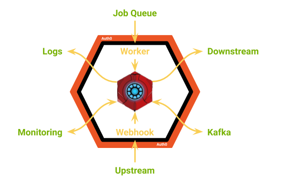

# Hexa-go

Based on the [Hexagonal architecture](https://en.wikipedia.org/wiki/Hexagonal_architecture_(software)) which:

> aims at creating loosely coupled application components that can be easily 
connected to their software environment by means of ports and adapters. This 
makes components exchangeable at any level and facilitates test automation

The goal of this repository is to provide a blueprint to quickly implement and
deploy business logic that can be consumed as a webhook and/or asynchronous
job with AuthN/AuthZ, centralised logging and monitoring features.

Just implement the `call` function in [hexagon.rb](vendor/hexagon.rb) and you're 
good to go 🙂 Use one of the _"pre-configured"_ providers and :shipit:!

The core of the hexagon is [the function](vendor/hexagon.rb) that implements the business logic. Such
function interacts with the external world by means of adapters and clients. 
With reference to the picture below:

* **adapters**
  * **webhook:** makes the function invokable from external systems via
  HTTP
  * **worker:** makes the function queueable by an external system such
  * **security:** provides AuthN/AuthZ functionalities _(Auth0)_
  as Sidekiq
* **clients**
  * **http:** used to invoke downstreams via HTTP
  * **Kafka:** used to read/write from/to Kafka stream
  * **logs:** used to push logs to a centralised system such as Splunk
  * **monitoring:** used to ping the system _(e.g. Pingdom)_ and/or to
  publish event to a centralised system such as Honeybadger
  * **others as required**

## Adapters

* [WIP] [Security](docs/adapters/security/README.md): provides machine-to-machine AuthN/AuthZ functionalities
* [Webhook](docs/adapters/webhook/README.md): makes the function invokable by an upstream but also monitorable _(e.g. Pingdom)_ through an healthcheck endpoint
* [WIP] [Worker](docs/adapters/worker/README.md): makes the function enqueuable

## Clients

* [WIP] [HTTP](docs/clients/http/README.md): used to post payloads to downstreams
* [WIP] [Kafka](docs/clients/kafka/README.md): reads/write to/from Kafka
* [WIP] [Logs](docs/clients/logs/README.md): push logs to a centralised system such as Splunk
* [Monitoring](docs/clients/http/monitoring.md): push messages to a monitoring system _(e.g. Honeybadger)_

## Deployment

* [Heroku](./deployment/heroku/README.md): webhooks and/or workers, any language
* [Render](./deployment/render/README.md): webhooks and/or workers, any language
* [WIP] [Netlify](./deployment/netlify/README.md): webhooks only,
JavaScript and Go only

## Use cases

* [TradeGecko event](docs/use-cases/tradegecko-event/README.md)
* [BigCommerce - Create New Product](docs/use-cases/bigcommerce-create-new-product/README.md)
* [BigCommerce - Update Existing Product](docs/use-cases/bigcommerce-update-existing-product/README.md)
