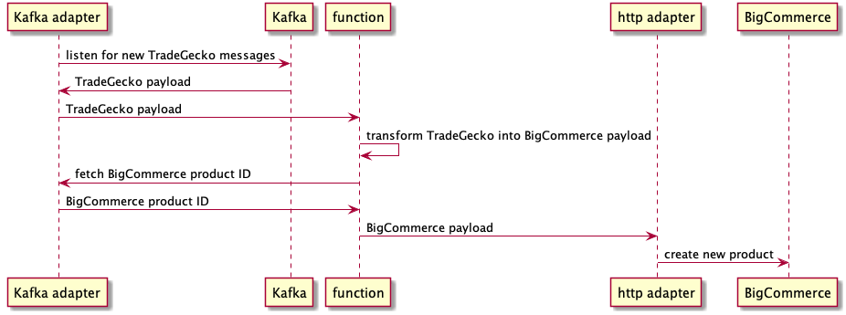

# BigCommerce - Update Existing Product

Similar to the previous scenario, with the difference that the product already 
exists in BigCommerce and its ID must be retrieved from Kafka _(compacted 
topic)_ first.

